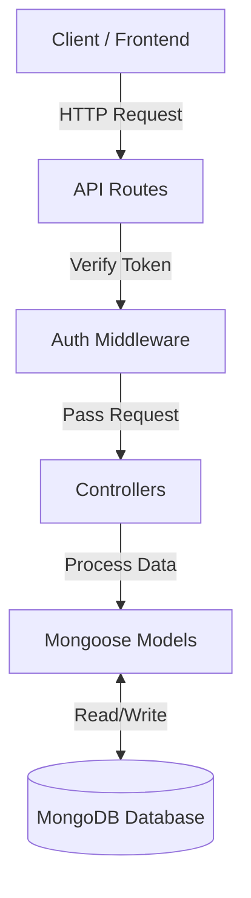

# 🎫 Ticket-System

<div align="center">


</div>

A secure and well-structured REST API for a Support Ticket Management System. This backend allows users to create, manage, and comment on support tickets, featuring role-based access control (RBAC), secure JWT authentication, and advanced filtering capabilities.

---

## 🚀 Features

- **Secure Authentication**: JWT-based authentication with secure HTTP-only cookies.
- **Role-Based Access Control (RBAC)**: Distinct permissions for `Admin` and `User` roles.
- **Ticket Management**: Create, view, update, and delete support tickets.
- **Interactive Commenting**: Users can add comments to tickets for better communication.
- **Custom Validation**: Robust server-side input validation for secure data handling.
- **Database Indexing**: Optimized MongoDB schemas for performance.

---

## 🏗️ System Architecture

The system follows a structured **MVC (Model-View-Controller)** pattern adapted for a RESTful API.



### 🔹 Layer Breakdown:
1.  **API Routes** (`/routes`): The entry point for all client requests. It defines the application's endpoints.
2.  **Middleware** (`/middleware`): Intercepts requests to handle **Authentication** (verifying JWTs) and **Authorization** (checking Admin vs User roles) before they reach the logic layer.
3.  **Controllers** (`/controllers`): Contains the core business logic. It validates user input, processes requests, and determines the response.
4.  **Models** (`/models`): Defines the data structure (Schema) interactions with the MongoDB database.
5.  **Database**: MongoDB stores all persistent data (Users, Tickets, Comments).

---

## 🛠️ Tech Stack

- **Backend**: Node.js, Express.js
- **Database**: MongoDB (Mongoose ODM)
- **Authentication**: JSON Web Tokens (JWT), Bcrypt.js
- **Client (Future/In-Progress)**: React, Vite, Tailwind CSS

---

## 📁 Project Structure

```text
Ticket-System/
├── backend/                # Server-side application
│   ├── config/             # Database & global configs
│   ├── controllers/        # Business logic for routes
│   ├── middleware/         # Auth & error handling logic
│   ├── models/             # Mongoose schemas
│   ├── routes/             # API endpoint definitions
│   ├── utils/              # Helper functions
│   └── server.js           # Entry point
├── README.md               # Project documentation
└── .gitignore              # Files to ignore in git
```

---

## ⚙️ Environment Variables

To run this project, you will need to add the following environment variables to your `.env` file in the `backend` directory:

| Variable | Description | Default |
| :--- | :--- | :--- |
| `PORT` | The port the server will run on | `5001` |
| `MONGO_URI` | Your MongoDB connection string | - |
| `JWT_SECRET` | Secret key for signing JWT tokens | - |
| `JWT_EXPIRES_IN` | Token expiration time | `7d` |
| `NODE_ENV` | Environment (development/production) | `development` |

---

## 🛠️ Getting Started

### Prerequisites

- [Node.js](https://nodejs.org/) (v16+)
- [MongoDB Atlas](https://www.mongodb.com/cloud/atlas) or a local MongoDB instance
- [NPM](https://www.npmjs.com/) or [Yarn](https://yarnpkg.com/)

### Installation & Setup

1. **Clone the repository**:
   ```bash
   git clone https://github.com/RUSIRUDEVINDA/Ticket-System.git
   cd Ticket-System
   ```

2. **Backend Setup**:
   - Navigate to the backend directory:
     ```bash
     cd backend
     ```
   - Install dependencies:
     ```bash
     npm install
     ```
   - Create a `.env` file based on `.env.example`:
     ```bash
     cp .env.example .env
     ```
   - Update `.env` with your actual MongoDB URI and JWT secret.

3. **Running the Server**:
   ```bash
   # Development mode (with nodemon)
   npm run dev

   # Production mode
   npm start
   ```

---

## 📚 API Documentation

This project includes fully configured **Postman Collections** to help you test the API easily.

### 📥 How to Import
1.  Navigate to the `backend/postman` folder in this repository.
2.  Open **Postman**.
3.  Click the **Import** button (top left).
4.  Drag and drop the following files:
    - `Auth.postman_collection.json`
    - `Ticket.postman_collection.json`
    - `Comment.postman_collection.json`
5.  All endpoints will be available in your Postman workspace, organized by functionality.

---

## 🛣️ API Endpoints (Quick Reference)

### Auth
- `POST /auth/register` - Register a new user
- `POST /auth/login` - Login and receive JWT

### Tickets
- `GET /tickets` - Get all tickets (Auth Required)
- `POST /tickets` - Create a new ticket
- `GET /tickets/:id` - Get specific ticket details
- `PUT /tickets/:id` - Update ticket status/content
- `DELETE /tickets/:id` - Remove a ticket

### Comments
- `POST /tickets/:id/comments` - Add a comment to a ticket
- `GET /tickets/:id/comments` - Get all comments for a ticket

---

## 📄 License

This project is licensed under the ISC License.

---

## 👤 Author

**Rusiru Devinda**
- GitHub: [@RUSIRUDEVINDA](https://github.com/RUSIRUDEVINDA)
